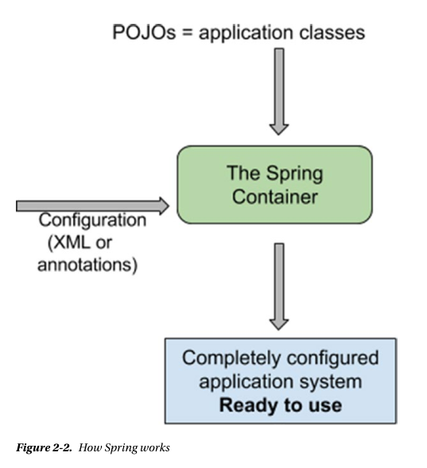

## The Basics
Any application system is make of components that work together to solve a problem. In object-oriented design they are called _classes_. Figure2-1 depicts the sequence of operations necessary to create a Person instance. Bacause this chapter is about Spring Core, a web application is not needed, so request to manipulate Person instances will be directed to implementations of the PersonManager interface. Implementations of this interface will provide access to the database using an implementation of PersonRepository interface. The operatin is pretty simple and the setup to write and execute the code should be too. This is where Spring comes in--providing a way to build an application using **p**lan **o**ld **J**ava **o**bject(POJOs)[^1] and applying enterprise services(transaction execution, remote execution) noninvasively.

[^1]A software term introduced by Martin Fowler, Rebeca Parsons, and Josh MacKenzie in September 2000 to refer to ordinary Java objects not bound by any restriction.

_**Figure2-1**. UML sequence of operations necessary to create a Person instance_

The components making up an application interact and depend on one another. Defining how those objects are composed is quite difficult using plain Java. Even with the help of all the design patterns defined by experts in the software industry, the work is still cumbersome, as the pattern components still have to be implemented before used. The Spring _invertion of control_(IoC) container was degined to help developers compose objects into fully working applications, ready to use[^2].

The Spring container is responsible for the creation of components,resolving their dependencies and providing them to other components. It does this by reading the configuration of an application from *.xml files or annotated configuration classes, and internally constructs a graph of dependencies between the objects. It then proceeds to traverse the graph, and creates and injects dependencies according to the configuration. The result of this initialization is an **ApplicationContext**,which provides access to application components, resource loading, internationalization support, and other features that won't be mentioned in this guide because it is out of scopy[^3].Figure2-2 depicts the process of creating an **ApplicationContext** using the Spring IoC container.

[^2]The process through which an object is provided its dependencies, whethere it is usig a constructor or properties which are set using setter methods, is called _dependency injection. inversion of control_ is the concept through which an external component has control over what is provided as a dependency to an object.
[^3]For more information, see the public reference documentation at http://docs.spring.io/spring/docs/current/spring-framework-reference.
